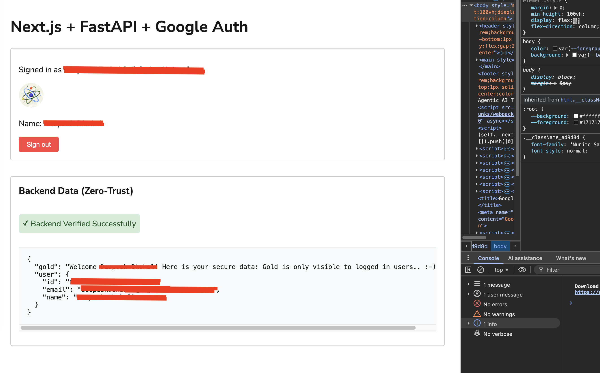
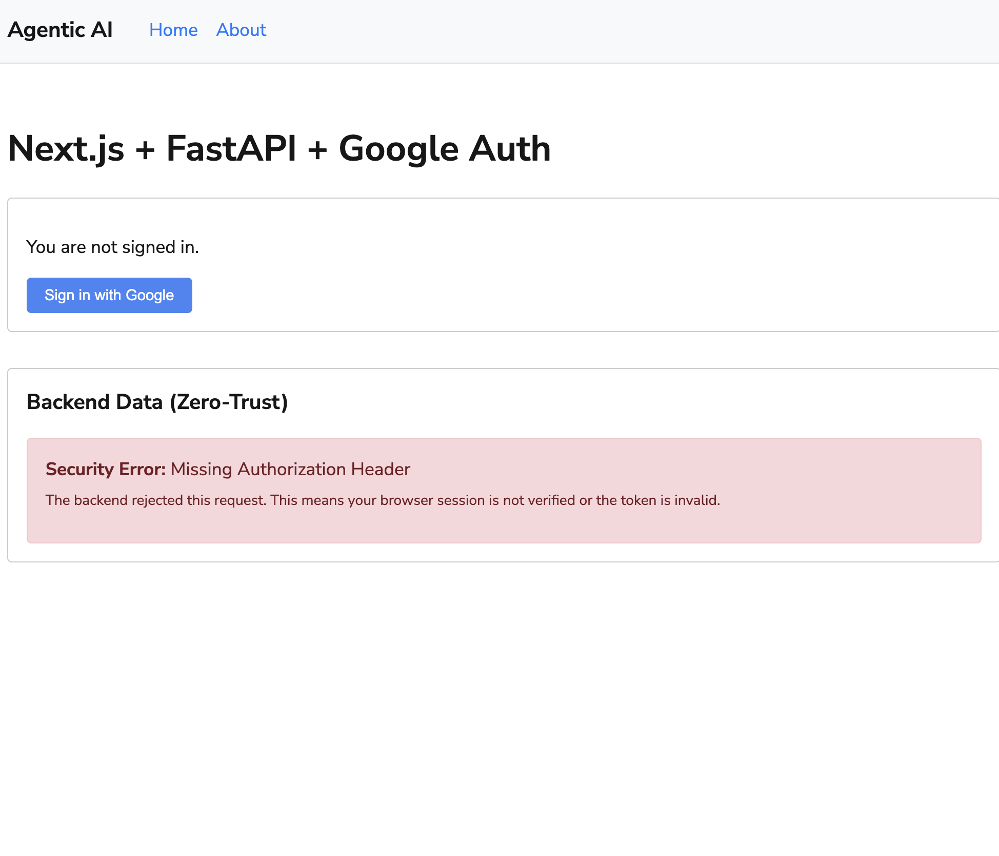

# Next.js + FastAPI + Google Authentication (Zero-Trust)

A robust, secure boilerplate for building applications with Next.js (frontend) and FastAPI (backend) using Google OAuth 2.0. This project implements a **Zero-Trust** security model where the backend cryptographically verifies the user's identity on every request.

## �️ Visual Showcase


*Figure 1: Application state when successfully authenticated and verified by the FastAPI backend.*


*Figure 2: Application state when unauthenticated, showing Zero-Trust security enforcement.*

## �🚀 Key Features

- **Google OAuth 2.0**: Seamless login flow via `next-auth`.
- **Zero-Trust Backend**: FastAPI enforces mandatory token verification for all protected endpoints.
- **Server-Side Proxy**: Next.js API layer securely forwards Google ID tokens to the backend, keeping sensitive logic away from the browser.
- **Dockerized Environment**: Fully containerized with `docker-compose` for local development and production-like environment synchronization.
- **Modern UI**: Built with Next.js App Router and Scss.

## 🛡️ Security Architecture

1.  **Frontend**: User logs in with Google. `next-auth` stores a secure JWT session.
2.  **API Bridge**: Client components call the Next.js API route.
3.  **Token Forwarding**: The Next.js API retrieves the raw Google `id_token` from the server-side session and forwards it to the FastAPI backend.
4.  **Backend Verification**: FastAPI uses the `google-auth` library to verify the token signature, expiration, and audience against Google's public keys.

## 🛠️ Getting Started

### 1. Prerequisites
- [Google Cloud Project](https://console.cloud.google.com/) with an OAuth 2.0 Client ID.
- Docker and Docker Compose.

### 2. Environment Setup
Create a `.env` file in the root directory:

```env
GOOGLE_CLIENT_ID=your_client_id.apps.googleusercontent.com
GOOGLE_CLIENT_SECRET=your_client_secret
NEXTAUTH_SECRET=a_very_long_random_string
NEXTAUTH_URL=http://localhost:3000
```

### 3. Run with Docker
```bash
docker compose up --build
```

The application will be available at:
- **Frontend**: http://localhost:3000
- **Backend**: http://localhost:8000
- **Health Check**: http://localhost:8000/health

## 📂 Project Structure

- `/frontend`: Next.js 15 application with App Router.
- `/backend`: FastAPI application with Python 3.11+.
- `docker-compose.yml`: Orchestration for both services and networking.

## 🔒 Session Policy
- Sessions are restricted to **24 hours** for enhanced security.
- Token verification is performed on **every request** to protected routes on the backend.

---
Built with 🛡️ for secure web development.
